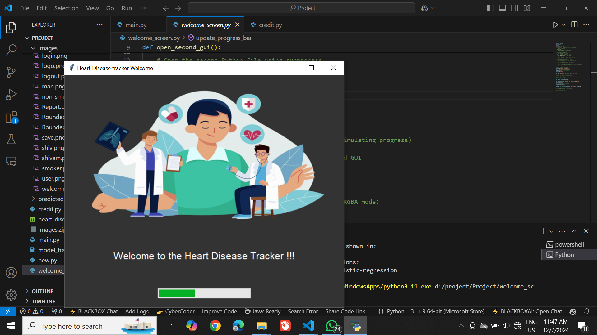
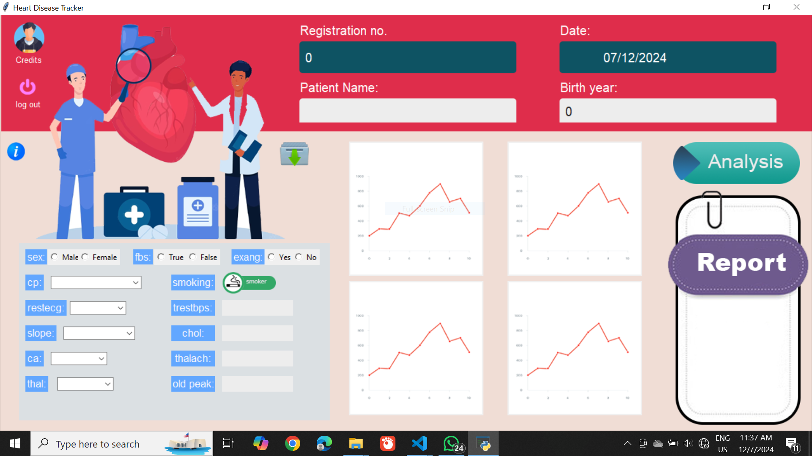
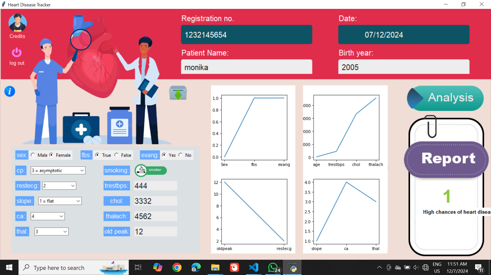
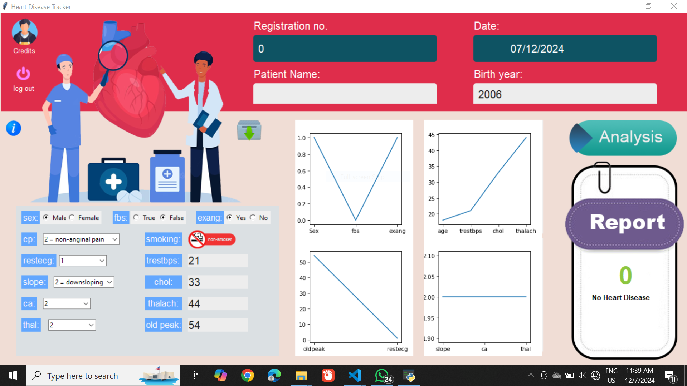

# Heart Disease Detection AI ❤️

A machine learning application to predict the risk of heart disease based on patient data. This project uses a **Logistic Regression** model built with Scikit-learn and features a user-friendly desktop interface created with **Tkinter**. The model achieves an accuracy of **85%**.


---

## 🚀 About The Project

Cardiovascular diseases are a leading cause of death globally. Early prediction of heart disease can be crucial for timely intervention and treatment. This project aims to build a simple yet effective tool that leverages machine learning to assess the risk of heart disease based on common medical attributes.

This application demonstrates a complete machine learning workflow, from data preprocessing and model training to building a functional GUI for real-world interaction.

---

## ✨ Key Features

* **Accurate Predictions:** Utilizes a Logistic Regression model with **85% accuracy** to classify patient risk.
* **Intuitive Interface:** A simple and clean Graphical User Interface (GUI) built with Tkinter for easy data entry.
* **Data-Driven:** Trained on a standard medical dataset to ensure relevant predictions.
* **Lightweight:** Built with standard Python libraries, making it easy to run on most systems.

---

## 🛠️ Tech Stack

* **Language:** Python
* **Machine Learning:** Scikit-learn
* **Data Manipulation:** Pandas, NumPy
* **GUI:** Tkinter

---

## Dataset

The model was trained on the "Heart Disease UCI" dataset, a widely used benchmark dataset for this classification task. You can find the dataset in repository.

---

## 📸 Screenshots

 



 




---

## 🏁 Getting Started

To get a local copy up and running, follow these simple steps.

### Prerequisites

* Python 3.8 or higher
* pip (Python package installer)

### Installation

1.  **Clone the repository.**
    ```sh
    git clone [https://github.com/your_username/heart-disease-detection.git](https://github.com/your_username/heart-disease-detection.git)
    cd heart-disease-detection
    ```

2.  **Create and activate a virtual environment (recommended).**
    ```sh
    # For Windows
    python -m venv venv
    .\venv\Scripts\activate

    # For macOS/Linux
    python3 -m venv venv
    source venv/bin/activate
    ```

3.  **Install the required dependencies.**
    ```sh
    pip install -r requirements.txt
    ```
  

---

## Usage Guide

1.  **Run the main application file.**
    ```sh
    python main.py
    ```


2.  **Using the App:**
    * Enter the patient's medical data into the respective input fields in the GUI.
    * Click the "Predict" button.
    * The application will display the prediction result, indicating whether the patient is at high or low risk of heart disease.

---

## 📈 Model Performance

The Logistic Regression model was evaluated on a held-out test set, achieving the following performance:

* **Accuracy:** 85%

A confusion matrix can provide further insight into the model's performance in correctly identifying positive and negative cases.


---

## 📄 License

This project is licensed under the MIT License. See the `LICENSE` file for more details.
